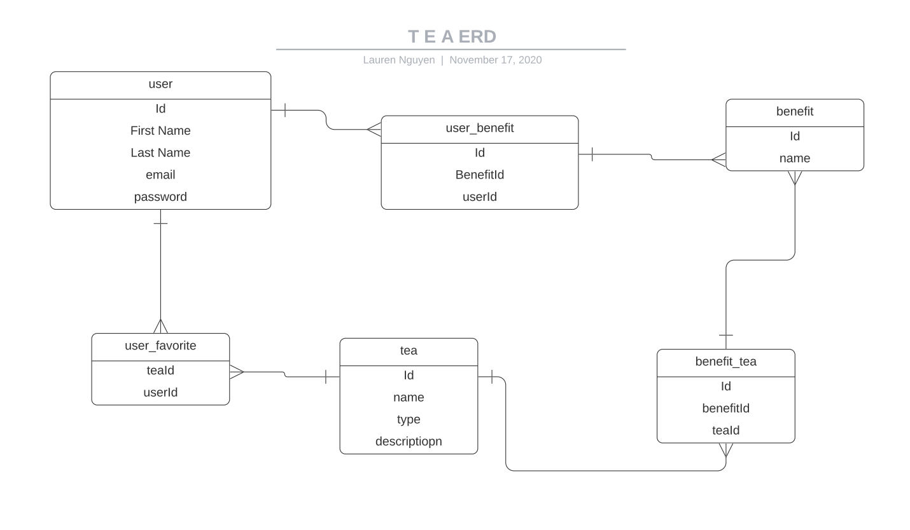
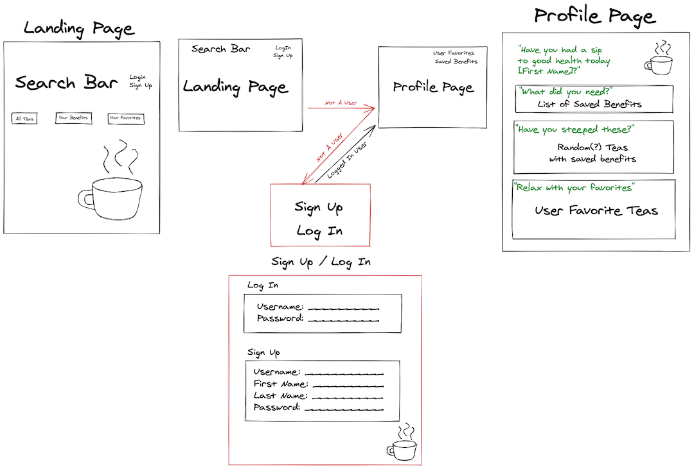
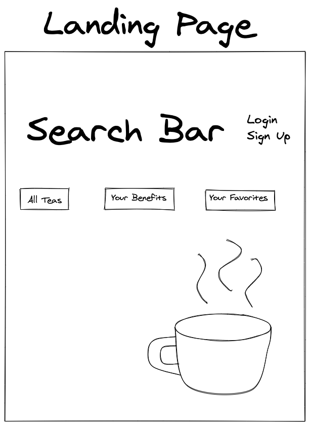
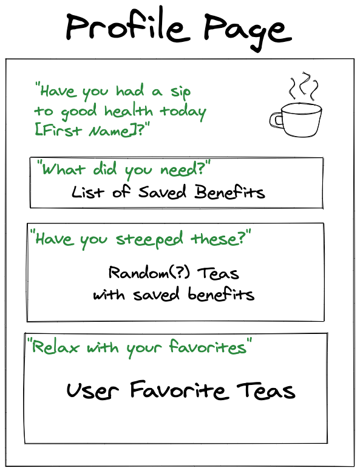
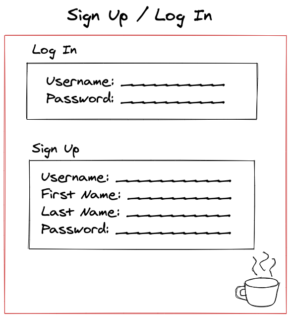
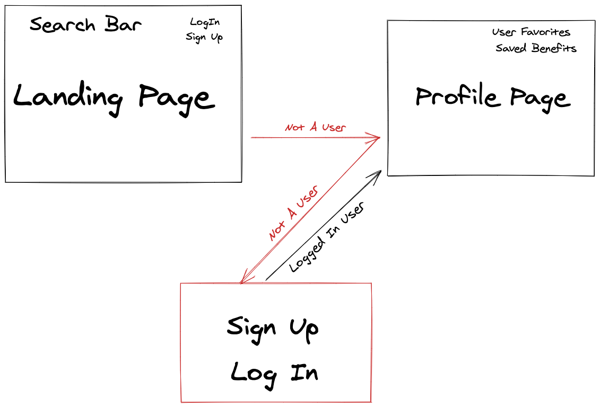
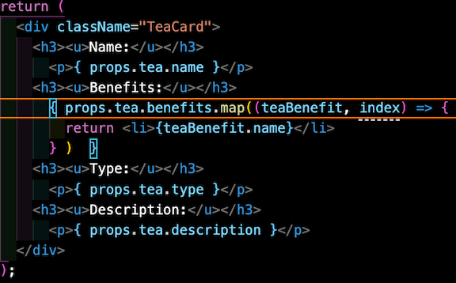
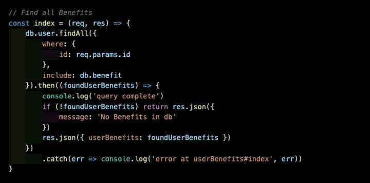
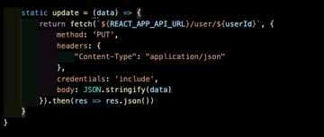

# Soul Sip'n
When people think of teas, they tend to think of "black tea", "green tea", "herbal tea", etc., but not many people think of the specific _types_ of those teas. For instance, "Matcha Tea" is a specific _type_ of Japanese green tea that is ceremoniously whisked into a frothy brew. There is also a difference between "Earl Gray Tea" and "Chai Tea" yet they're both broadly classified as black tea.

Aside from the specificities of the different types of teas, tea in and of itself is very beneficial to your health. Depending on the type of tea your soul wants to sip, your body gets different types of benefits. Many different teas can help ease headaches, increase blood flow, and even reduce body fat.

There's so much more to the **brew**tiful world of tea, and with Soul Sip'n users can expand their knowledge of the leafy liquid. Whether that's by scrolling through all 100+ different types of teas in our database, or by saving specific benefits to their profile and finding teas that contain that special remedy, Soul Sip'n is here for you.

Join us, in a sip to better health.

## Motivation
For this project, the team wanted to go with something that users can benefit from and use on more than one occasion. The outside world is currently at a very confusing and unsettling time. We wanted users to have a website where they can feel relaxed and even for a split second, not worry about the world around them. The team wanted a website that could be used over and over again by providing facts and useful info that a user could come back to if they wanted to discover new items.

## User Stories
- As a user, I want to feel relaxed when I use this app.
- As a user, I want to sign up for "Soul Sip'n".
- As a user, I want to view all teas.
- As a visitor, I want to be able to browse teas and benefits.
- As a logged in user, I want to save necessary benefits specific to me.
- As a logged in user, I want to be able to view my saved benefits.
- As a logged in user, I want to be able to edit my user information.

## Technologies Used
For Soul Sip'n we used many different technologies.
- Postgres
- Express
- React
- Node.js
- React-Strap
- SASS
- React Spring

## ERD

Here is the ERD for all of the database workings and associations.

## Wireframing / Pre-Code Planning

## Code Snippets

This code is the snippet of code on the "TeaCard" page. It shows the solution to our blocker of having to display two databases on one page.

This code is where the database finds all users by their id and includes their saved benefits if there are any. If there are no benefits saved then a message will prompt stating that there isn't any saved benefits in the database. There is also an included catch error that will trigger if there was a problem with returning the data of the user.

Here is code that shows how the update feature works. The data for a user gets updated using the PUT method and accessing the correct URL path by accessing the user's id and having the JSON stringify the newly entered data.

## Blockers and Unsolved Problems
The team had a lot of blockers while making this app. The databases was one of the hardest hurdles to overcome. With the confusing one to many and many to many relationships about the many teas and the many benefits, databases were created and dropped _many_ times. Thankfully, Lauren and Brock were able to create the perfect database for all the tea and benefit info.

Another blocker the team had was connecting the front-end to the back-end. This was the first project where the team had to create two separate repos, one for front-end and one for back-end. In the past, the repos would heavily lean towards one end, but this was the first time where it is equally balanced. The team was able to overcome this blocker with the help of TA's and instructors.

A big blocker for the team was displaying the the different "Benefits" onto the individual tea cards. The tea information and the benefit information are stored in 2 separate databases. Connecting them onto a single page was something the team had never done before. After a lot of paired programming and help with a TA, the blocker was finally overcome with very satisfying results.

A blocker that Lauren and Brock also faced was getting the profile page to display the specific info about the user. There were times when the page would not display the saved benefit(s), the user's name, or update any changes to the user, but thankfully to the back-end experts, Brock and Lauren were able to overcome the many obstacles and succeed in a better experience for the user.

## Future Enhancements
For this project we had a few plans that we didn't quite get to. With the time allotted we just weren't able to implement those features into the final product, but we hope to include them with future updates. Here is what we had in mind.
- Allowing the logged in user to favorite teas and view this in their profile. 
- Adding a "Recommended Tea" that pulls one tea based off the users saved benefits
- Theme changes based on the type of tea the user is reading on.
- Implement a "Read More" button to replace the "Description" section.
- Add some relaxing audio to soothe the user.

## Special Thanks To...
Without these people, the app would not be where it is today!

Instructors and TAs
- Brock Whitbread-Cole
- James Sinkler
- Jacob Kleiman
- Seanny Phoenix

Supportive Classmates
- Ashley Nguyen
- Kelsey Whallon
